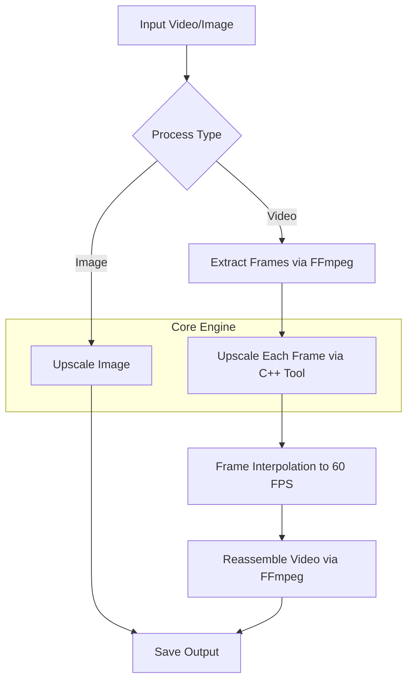

<h1>Go Image &amp; Video Upscaler</h1>

<strong>Created by Md. Mahir Labib</strong> 
Copyright © 2026 Md. Mahir Labib. All rights reserved.

This project is a high-performance, command-line tool written in <strong>C++</strong> for upscaling images and videos. It utilizes a custom, pre-trained model to perform a 3x upscale, with a focus on unblurring and denoising the source material. The processing is done in parallel to leverage multi-core CPUs for significant speed improvements.

## Workflow

<h2>Features</h2>
<ul>
  <li><strong>3x Image Upscaling</strong>: Enhance the resolution of images (PNG) by a factor of 3.</li>
  <li><strong>3x Video Upscaling</strong>: Process videos by extracting frames, upscaling them individually, and reassembling them into a high-resolution video file.</li>
  <li><strong>Unblur &amp; Denoise</strong>: The included model is trained not just to enlarge, but also to correct common imperfections like blur and noise.</li>
   <li><strong>High Performance</strong>: Leverages C++ and parallel processing to process image rows or video frames in parallel across all available CPU cores.</li>
  <li><strong>Command-Line Interface</strong>: Simple and clear flags for easy operation on local files.</li>
  <li><strong>Self-Contained Model</strong>: Uses a pre-trained model stored in a <code>.gob</code> file, which is Go's native binary format.</li>
</ul>

<h2>Prerequisites</h2>

Before using this tool, you must have the following software installed on your system:

<ol>
   <li>
       <strong>C++ Compiler</strong>: A modern C++ compiler (GCC, Clang, or MSVC) supporting C++17 or later.
   </li>
  <li>
      <strong>FFmpeg</strong>: A powerful multimedia framework used to extract frames from the input video and reassemble them with audio.
      <ul>
          <li>Installation instructions can be found on the <a href="https://ffmpeg.org/download.html" target="_blank" rel="noopener noreferrer">official FFmpeg website</a>.</li>
          <li>Ensure that both <code>ffmpeg</code> and <code>ffprobe</code> are available in your system's <code>PATH</code>. You can verify this by running <code>ffmpeg -version</code> and <code>ffprobe -version</code> in your terminal.</li>
      </ul>
  </li>
</ol>

<h2>Installation &amp; Setup</h2>
<ol>
  <li>
      <strong>Clone the Repository</strong>
      <pre><code>git clone &lt;repository-url&gt;
cd &lt;repository-directory&gt;</code></pre>
  </li>
  <li>
      <strong>Get the Model File</strong>
      
This program requires the model file <code>unblur_denoice_shared_model_x3_20.gob</code> to be present in the same directory as the executable.

  </li>
  <li>
       <strong>Build the Executable</strong>
       
Create a binary from the source code. This command will produce an executable file (e.g., <code>upscaler</code> on Linux/macOS or <code>upscaler.exe</code> on Windows).

       <pre><code>g++ -O3 -o upscaler main.cpp -lpthread</code></pre>
  </li>
</ol>

<h2>Usage</h2>

The tool is operated via command-line flags. The primary mode is <code>upscale</code>.

<h3>Image Upscaling</h3>

To upscale a single image:

<pre><code>./unblur_server_binary -mode=upscale -lr=input.png -out=output_upscaled.png</code></pre>
<ul>
  <li><code>-mode=upscale</code>: Specifies the operation mode.</li>
  <li><code>-lr=&lt;path&gt;</code>: Path to the low-resolution input image.</li>
  <li><code>-out=&lt;path&gt;</code>: Path for the resulting high-resolution output image.</li>
</ul>

<h3>Video Upscaling</h3>

To upscale a video file:

<pre><code>./unblur_server_binary -mode=upscale -videoin=my_video.mp4 -videoout=my_video_upscaled.mp4</code></pre>
<ul>
  <li><code>-videoin=&lt;path&gt;</code>: Path to the low-resolution input video.</li>
  <li><code>-videoout=&lt;path&gt;</code>: Path for the resulting high-resolution output video.</li>
</ul>

The tool will automatically handle:

<ul>
  <li>Creating a temporary directory for frames.</li>
  <li>Extracting all frames from the input video using <code>ffmpeg</code>.</li>
  <li>Upscaling each frame in parallel.</li>
  <li>Reassembling the upscaled frames into a new video.</li>
  <li>Copying the audio track from the original video to the final output.</li>
</ul>

<h3>Using a Different Model</h3>

You can specify a different model file using the <code>-model</code> flag:

<pre><code>./unblur_server_binary -mode=upscale -lr=input.jpg -model=another_model.gob -out=output.png</code></pre>

