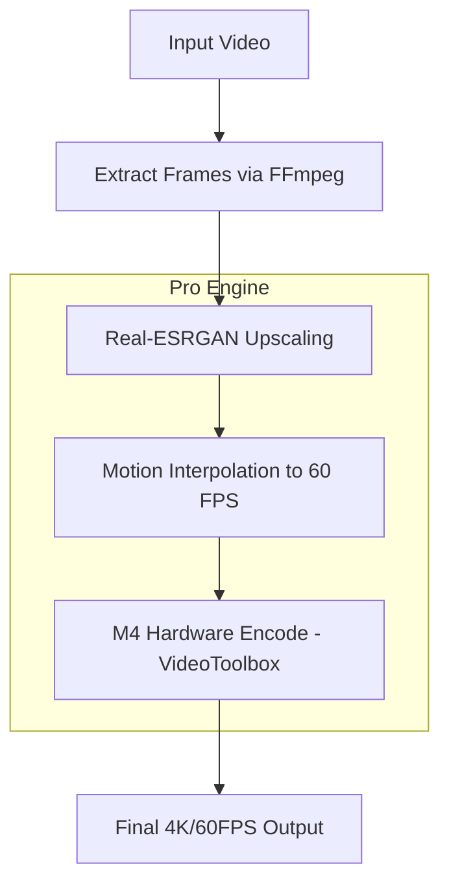

<h1>Video Upscaler Pro</h1>
<p><strong>Created by Md. Mahir Labib</strong><br>
Copyright © 2026 Md. Mahir Labib. All rights reserved.</p>

<p>A professional, high-performance command-line tool written in <strong>C++</strong> for upscaling videos and images. This "Pro" version is specifically optimized for <strong>Apple Silicon (M1/M2/M3/M4)</strong>, leveraging hardware-accelerated encoding (VideoToolbox) and motion-compensated frame interpolation for smooth 60 FPS output.</p>

<div align="center">
  
  
  
</div>

## Workflow



## Features
- **Apple Silicon Optimized**: Uses `h264_videotoolbox` for lightning-fast hardware encoding on M-series chips.
- **Real-Time Progress**: Dynamic ANSI progress bar tracks upscaling progress in the terminal.
- **Motion Interpolation**: Native support for creating smooth 60 FPS video from low-framerate sources.
- **Fail-Safe Cleanup**: Automatic signal handling ensures temporary files are deleted even if interrupted (Ctrl+C).
- **Professional CLI**: Comprehensive flag support for input, output, scale, and model selection.

## Prerequisites
- **macOS** with Apple Silicon (Recommended for VideoToolbox acceleration).
- **FFmpeg**: Must be installed and available in `PATH`.
- **Real-ESRGAN Binary**: `realesrgan-ncnn-vulkan` must be in the project root.

## Installation
```bash
# Build the Pro version
g++ -O3 -o upscaler_pro main.cpp -lpthread -std=c++17
```

## Usage
The Pro version uses professional CLI flags:

```bash
./upscaler_pro --input my_video.mp4 --output high_res.mp4 --fps 60 --scale 4
```

### Options
| Flag | Short | Default | Description |
|---|---|---|---|
| `--input` | `-i` | (Required) | Path to input video/image. |
| `--output` | `-o` | `output_pro.mp4` | Path for the high-res result. |
| `--fps` | `-f` | `60` | Target framerate for interpolation. |
| `--scale` | `-s` | `4` | Upscale ratio (e.g., 2, 3, 4). |
| `--model` | `-m` | `realesrgan-x4plus` | Model name (e.g., `realesr-animevideov3`). |

## Architecture Notes
The tool operates as a high-level orchestrator:
1. **Extraction**: Decodes the input video into high-quality intermediate frames.
2. **AI Upscaling**: Executes the NCNN-optimized Real-ESRGAN engine.
3. **Interpolation**: Applies motion estimation filters to "guess" missing frames for 60 FPS.
4. **Encoding**: Pipes the processed frames into the Apple Media Engine for final compression.
